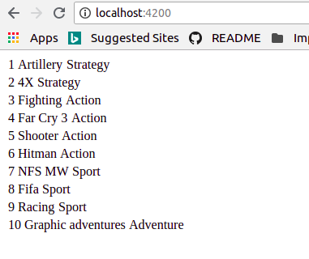
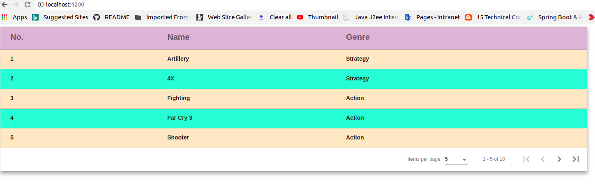
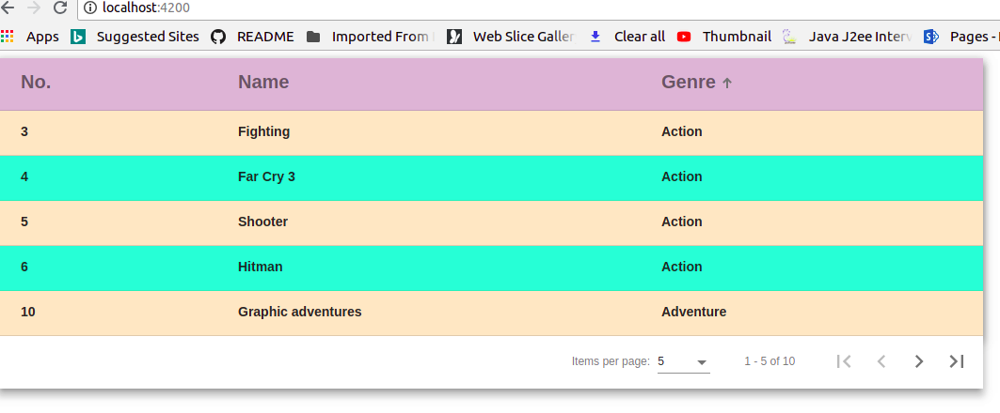
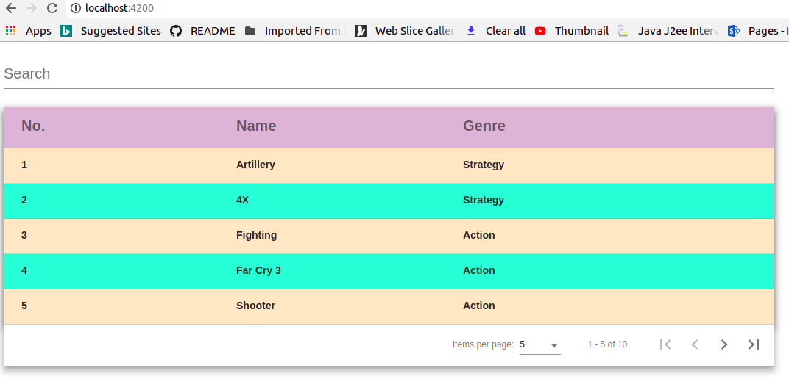
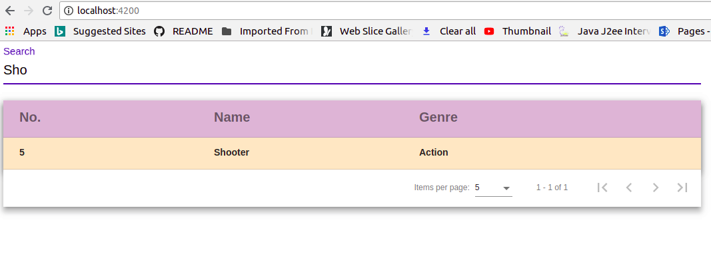

# Angulartabledemo using Angular Material

This project explains how to display records in tale with pagination, sorting and filtering using angular material.

I assumed you already install angular cli.

### Angular material install
============================

Step:1 npm install --save @angular/material @angular/cdk
Step:2 npm install --save @angular/animations (for animations)
Step:3 Add @import "~@angular/material/prebuilt-themes/indigo-pink.css"; in styles.css (for theme)
Step:4 npm install --save hammerjs (for gesture support)
Step:5 Add import 'hammerjs'; in src/main.ts
Step:6 Add <link href="https://fonts.googleapis.com/icon?family=Material+Icons" rel="stylesheet"> in index.html (for icons)

### Angular Tableview with pagination,sorting and filtering using Angular Material
===============================================================================

### Normal View
================

1. Created new angular project angulartabledemo ng new angulartabledemo && cd angulartabledemo

2. Created new component ng g c game -m app.module

3  Created game.ts

```
export interface GamesElement {
    id: string;
    name: string;
    genre: string;
}
```

4. game.component.ts

```
import { Component, OnInit } from '@angular/core';
import { GamesElement } from './game';

@Component({
  selector: 'app-game',
  templateUrl: './game.component.html',
  styleUrls: ['./game.component.css']
})
export class GameComponent implements OnInit {
  allgames: any[];
  constructor() { }

  ngOnInit() {
    this.allgames = allgames;
  }
}

const allgames: GamesElement[] = [
  {
    'id': '1',
    'name': 'Artillery',
    'genre': 'Strategy'
  },
  {
    'id': '2',
    'name': '4X',
    'genre': 'Strategy'
  },
  {
    'id': '3',
    'name': 'Fighting',
    'genre': 'Action'
  },
  {
    'id': '4',
    'name': 'Far Cry 3',
    'genre': 'Action'
  },
  {
    'id': '5',
    'name': 'Shooter',
    'genre': 'Action'
  },
  {
    'id': '6',
    'name': 'Hitman',
    'genre': 'Action'
  },
  {
    'id': '7',
    'name': 'NFS MW',
    'genre': 'Sport'
  }, {
    'id': '8',
    'name': 'Fifa',
    'genre': 'Sport'
  }, {
    'id': '9',
    'name': 'Racing',
    'genre': 'Sport'
  }, {
    'id': '10',
    'name': 'Graphic adventures',
    'genre': 'Adventure'
  }
];

```
4. game.component.html

```
<table *ngFor="let game of allgames">
  <tr>
    <td>{{game.id}}</td>
    <td>{{game.name}}</td>
    <td>{{game.genre}}</td>
  </tr>
</table>
```


### Angular material Table view with Pagination
==============================================

1: Import MatTableModule and MatPaginatorModule in app.module.ts

```
import { MatTableModule,MatPaginatorModule } from '@angular/material';

imports: [
    BrowserModule,
    MatTableModule,
    MatPaginatorModule
  ]

```

2: game.component.ts 

```
import { Component, OnInit, ViewChild} from '@angular/core';
import { GamesElement } from './game';
import { MatTableDataSource, MatPaginator } from '@angular/material';

@Component({
  selector: 'app-game',
  templateUrl: './game.component.html',
  styleUrls: ['./game.component.css']
})
export class GameComponent implements OnInit {

  displayedColumns = ['id', 'name', 'genre'];
  games = new MatTableDataSource<GamesElement>(allgames);
  @ViewChild(MatPaginator) paginator: MatPaginator;

  constructor() { }

  ngOnInit() {
    this.games.paginator = this.paginator;
  }
}

// Add const allgames (shown above) 

```

3. game.component.html

```
<div class="mat-elevation-z8">
  <table mat-table [dataSource]="games">
   <!-- Id Column -->
   <ng-container matColumnDef="id">
    <th mat-header-cell *matHeaderCellDef> No. </th>
    <td mat-cell *matCellDef="let element"> {{element.id}} </td>
  </ng-container>
  
  <!-- Name Column -->
  <ng-container matColumnDef="name">
    <th mat-header-cell *matHeaderCellDef> Name </th>
    <td mat-cell *matCellDef="let element"> {{element.name}} </td>
  </ng-container>
  
  <!-- Genre Column -->
  <ng-container matColumnDef="genre">
    <th mat-header-cell *matHeaderCellDef> Genre </th>
    <td mat-cell *matCellDef="let element"> {{element.genre}} </td>
  </ng-container>
  
  <tr mat-header-row *matHeaderRowDef="displayedColumns"></tr>
  <tr mat-row *matRowDef="let row; columns: displayedColumns;"></tr>
  
  </table>
  <mat-paginator [pageSizeOptions]="[5,10,20]" showFirstLastButtons></mat-paginator>
</div>

```

4. game.component.css

```
.mat-elevation-z8 {
    width: 75%;
}

table {
    width: 100%;
}

.mat-header-row, .mat-header-cell {
    background-color: thistle;
    font-family: Verdana, Geneva, Tahoma, sans-serif;
    font-size: 20px;
    font-weight: bold;
}

.mat-row:nth-child(even){
    background-color: aquamarine;
    font-family: Verdana, Geneva, Tahoma, sans-serif;
    font-size: 20px;
    font-weight: bold;
}

.mat-row:nth-child(odd){
    background-color: bisque;
    font-family: Verdana, Geneva, Tahoma, sans-serif;
    font-size: 20px;
    font-weight: bold;
}
```

Screenshot:




### Angular material Table view with Pagination and Sorting
===========================================================

1: Import MatSortModule and BrowserAnimationsModule in app.module.ts

```
import { MatTableModule,MatPaginatorModule, MatSortModule } from '@angular/material';
import {BrowserAnimationsModule} from '@angular/platform-browser/animations';

imports: [
    BrowserModule,
    MatTableModule,
    MatPaginatorModule,
    MatSortModule,
    BrowserAnimationsModule
  ]

```

2. Modified game.component.ts

```
import { MatTableDataSource, MatPaginator, MatSort } from '@angular/material';
@ViewChild(MatSort) sort: MatSort;
  ngOnInit() {
    this.games.paginator = this.paginator;
    this.games.sort = this.sort;
  }

```

3. Modified game.component.html

```
<div class="mat-elevation-z8">
  <table mat-table [dataSource]="games" matSort class="mat-elevation-z8">
   <!-- Id Column -->
   <ng-container matColumnDef="id">
    <th mat-header-cell *matHeaderCellDef mat-sort-header> No. </th>
    <td mat-cell *matCellDef="let element"> {{element.id}} </td>
  </ng-container>
  
  <!-- Name Column -->
  <ng-container matColumnDef="name">
    <th mat-header-cell *matHeaderCellDef mat-sort-header> Name </th>
    <td mat-cell *matCellDef="let element"> {{element.name}} </td>
  </ng-container>
  
  <!-- Genre Column -->
  <ng-container matColumnDef="genre">
    <th mat-header-cell *matHeaderCellDef mat-sort-header> Genre </th>
    <td mat-cell *matCellDef="let element"> {{element.genre}} </td>
  </ng-container>
  
  <tr mat-header-row *matHeaderRowDef="displayedColumns"></tr>
  <tr mat-row *matRowDef="let row; columns: displayedColumns;"></tr>
  
  </table>
  <mat-paginator [pageSizeOptions]="[5,10,20]" showFirstLastButtons></mat-paginator>
  </div>

```

Screenshot:




### Angular material Table view with Pagination, Sorting and Filtering
======================================================================

1: Import FormsModule, ReactiveFormsModule and MatInputModule in app.module.ts

```
import { MatTableModule,MatPaginatorModule, MatSortModule, MatInputModule } from '@angular/material';
import {FormsModule, ReactiveFormsModule} from '@angular/forms';
imports: [
    BrowserModule,
    MatTableModule,
    MatPaginatorModule,
    MatSortModule,
    MatInputModule,
    BrowserAnimationsModule,
    ReactiveFormsModule,
    FormsModule
  ]
```

2. Added game.component.html for filtering

```
<mat-form-field>
  <input matInput (keyup)="applyFilter($event.target.value)" placeholder="Search">
</mat-form-field>

<div class="mat-elevation-z8">
	--same code for sorting implementation--
</div>

```
3. Add css in game.component.css

```
.mat-form-field {
    font-size: 20px;
    width: 55%;
  }
```
4. Added applyFilter function in game.component.ts

```
  applyFilter(filterVal: string) {
    filterVal = filterVal.trim();
    filterVal = filterVal.toLowerCase();
    this.games.filter = filterVal;
  }

```

Screenshot





# Happy Coding

